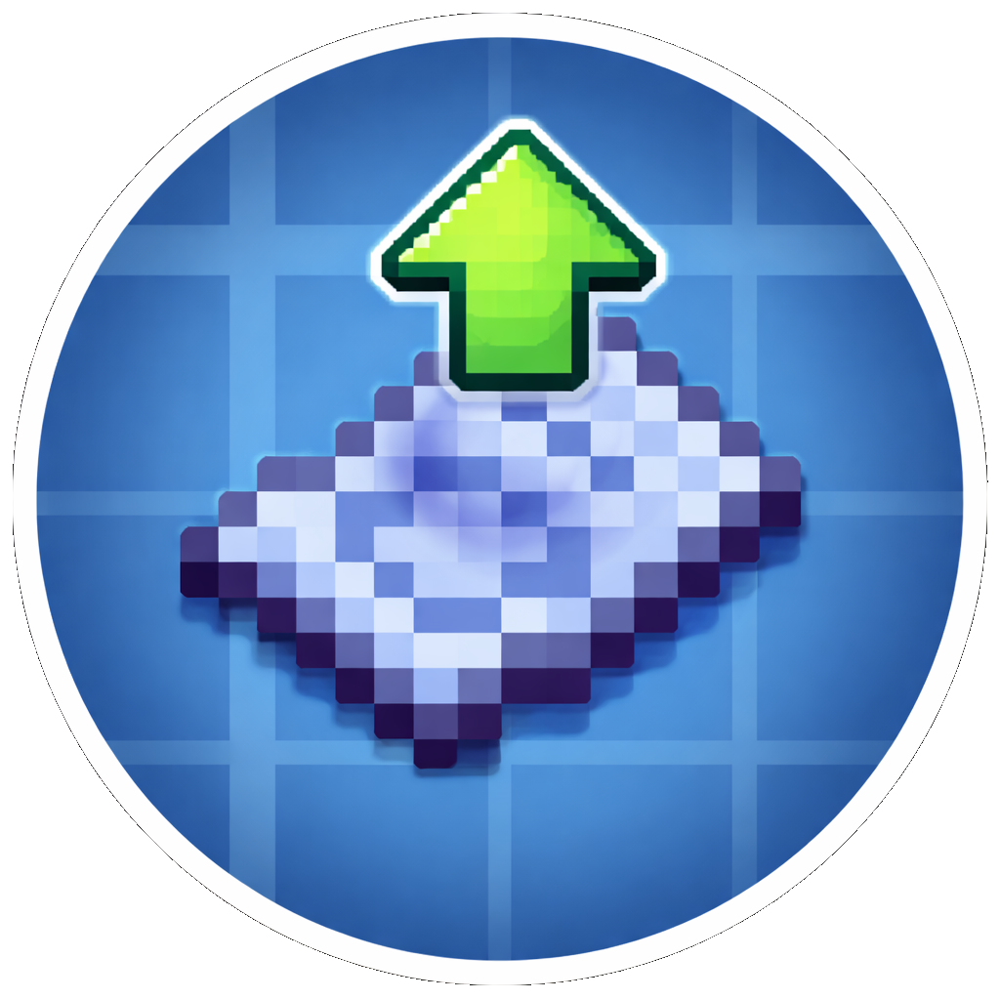

<p align="center">
  
</p>

<h1 align="center">CreateSchematicUpload</h1>

<p align="center">
  A Minecraft mod that automatically uploads Create mod schematics to
  <a href="https://createmod.com">createmod.com</a> for easy sharing.
</p>

<p align="center">
  <a href="https://github.com/uberswe/CreateSchematicUpload/actions/workflows/build.yml"></a>
  <a href="https://github.com/uberswe/CreateSchematicUpload/releases/latest"></a>
  <a href="https://modrinth.com/mod/create-schematic-upload"></a>
  <a href="https://www.curseforge.com/projects/1483578"></a>
  
  
  <a href="https://github.com/uberswe/CreateSchematicUpload/blob/main/LICENSE"></a>
</p>

---

## Features

- **Automatic upload** &mdash; schematics are uploaded to [createmod.com](https://createmod.com) the moment you save them in-game
- **One-click sharing** &mdash; a clickable link appears in chat so you (or anyone) can view the schematic in a browser
- **Claim flow** &mdash; log in on the website to claim ownership, then publish to the community
- **Optional confirmation** &mdash; disable auto-upload in the config to get a confirmation screen before each upload
- **No account needed in-game** &mdash; uploads are anonymous; you claim them on the website when you're ready

## Side

This is a **client-side only** mod. It does not need to be installed on the server.

## Requirements

| Dependency | Version |
|---|---|
| Minecraft | 1.21.1 |
| NeoForge | 21.1+ |
| Create | 6.0+ |

## Installation

1. Install [NeoForge](https://neoforged.net/) for Minecraft 1.21.1
2. Install the [Create](https://modrinth.com/mod/create) mod
3. Drop the CreateSchematicUpload `.jar` into your `mods/` folder
4. Launch the game

## Configuration

The config file is located at `config/createschematicupload-client.toml`:

| Option | Default | Description |
|---|---|---|
| `enabled` | `true` | Enable or disable the upload feature entirely |
| `autoUpload` | `true` | Upload automatically on save (if `false`, a confirmation screen is shown) |
| `baseUrl` | `https://createmod.com` | API base URL |

## How It Works

1. Save a schematic using the Create mod's Schematic and Quill
2. The mod uploads the `.nbt` file to createmod.com
3. A clickable link appears in chat
4. Visit the link and log in to **claim** the schematic as yours
5. From there you can publish it to the community

## Building from Source

```bash
git clone https://github.com/uberswe/CreateSchematicUpload.git
cd CreateSchematicUpload
./gradlew build
```

The built jar will be in `build/libs/`.

## Modpacks

You are free to include this mod in any modpack that is distributed for free. Selling this mod or charging money for access to it (or any modpack containing it) is not permitted.

## License

See [LICENSE](LICENSE) for details.
